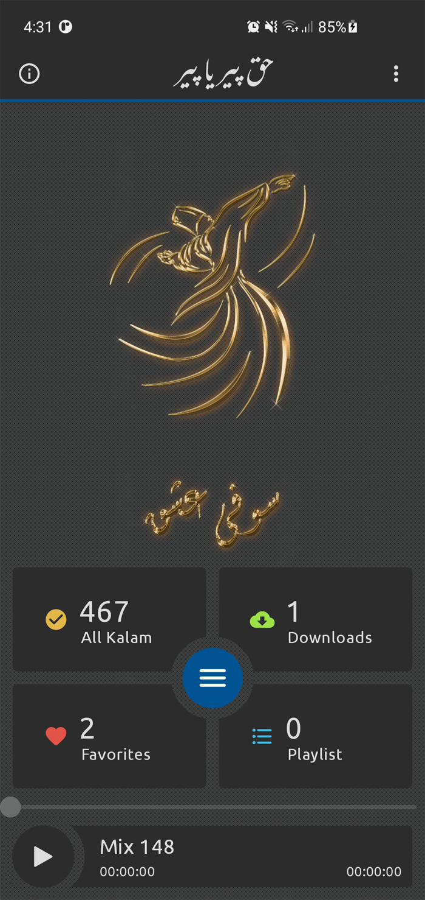
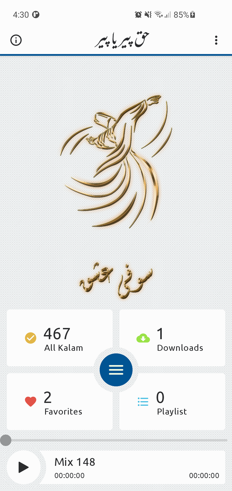

<div align="center">  
  
<h1 align="center">Sufi Ishq</h1>  
 
<a href="https://sonarcloud.io/summary/new_code?id=sufiishq_sufiishq-mobile">  
      
</a>  
<a href="https://sonarcloud.io/summary/new_code?id=sufiishq_sufiishq-mobile">  
      
</a>  
<a href="https://sonarcloud.io/summary/new_code?id=sufiishq_sufiishq-mobile">  
      
</a>  
<a href="https://sonarcloud.io/summary/new_code?id=sufiishq_sufiishq-mobile">  
      
</a>  
<a href="https://sonarcloud.io/summary/new_code?id=sufiishq_sufiishq-mobil">  
      
</a>  
<a href="https://sonarcloud.io/summary/new_code?id=sufiishq_sufiishq-mobile">  
      
</a>  
<a href="https://sonarcloud.io/summary/new_code?id=sufiishq_sufiishq-mobile">  
      
</a>

<br />

<p>
<a href="https://github.com/sufiishq/sufiishq-mobile/issues/new/choose">Report Bug</a>  
·  
<a href="https://github.com/sufiishq/sufiishq-mobile/issues/new/choose">Code Health</a>  
·  
<a href="https://github.com/sufiishq/sufiishq-mobile/issues/new/choose">Enhancement</a>  
·  
<a href="https://github.com/sufiishq/sufiishq-mobile/issues/new/choose">Request Feature</a>  
·  
<a href="https://github.com/sufiishq/sufiishq-mobile/issues/new/choose">Help Wanted</a>  
·  
<a href="https://github.com/sufiishq/sufiishq-mobile/issues/new/choose">Research</a>  
</p>
<br />
</div>  


| Dark                             | Light |
|----------------------------------|------|
|  |

## 💻 Install

| Platform | Download | Status |  
|----------|----------|--------|  
| Android  |<a href='https://play.google.com/store/apps/details?id=pk.sufiishq.app'></a>| 💚 Production |  

## 🏗️️ Built with

| Component                   | Tool                                                                                                                                                                                                                                                                                 |  
|-----------------------------|--------------------------------------------------------------------------------------------------------------------------------------------------------------------------------------------------------------------------------------------------------------------------------------|  
| 🎭  User Interface          | [Jetpack Compose](https://developer.android.com/jetpack/compose) + [Aurora](https://github.com/sufiishq/sufiishq-mobile/tree/master/aurora)                                                                                                                                          |  
| 🏗  Architecture            | [MVVM](https://en.wikipedia.org/wiki/Model%E2%80%93view%E2%80%93viewmodel)                                                                                                                                                                                                           |  
| 🧠  Backend                 | [NodeJS Server](https://nodejs.org/en/)                                                                                                                                                                                                                                              |  
| 💉  DI                      | [Hilt](https://dagger.dev/hilt/)                                                                                                                                                                                                                                                     |  
| 🛣️  Navigation             | [Compose Navigation](https://developer.android.com/jetpack/compose/navigation)                                                                                                                                                                                                       |  
| 🌊  Async                   | [Coroutines](https://kotlinlang.org/docs/coroutines-overview.html) + [Flow + StateFlow + SharedFlow](https://kotlin.github.io/kotlinx.coroutines/kotlinx-coroutines-core/kotlinx.coroutines.flow/) + [LiveData](https://developer.android.com/topic/libraries/architecture/livedata) |  
| ⬇️ Downloading              | [Coroutines Flow](https://kotlinlang.org/docs/coroutines-overview.html)                                                                                                                                                                                                              |  
| 📄  Serialization           | [Kotlin Serialization](https://github.com/Kotlin/kotlinx.serialization) + [Gson](https://github.com/google/gson)                                                                                                                                                                                                   |  
| 🔥  Firebase                | [Crashlytics](https://firebase.google.com/docs/crashlytics) + [Realtime Database](https://firebase.google.com/products/realtime-database) + [App Check](https://firebase.google.com/products/app-check) + [Authentication](https://firebase.google.com/products/auth)                |  
| ✨  Audio Editor             | [FFMpeg](https://ffmpeg.org/) + [EPMedia](https://github.com/yangjie10930/EpMedia)                                                                                                                                                                                                   |
| 🔀  Animation               | [Lottie](https://lottiefiles.com/)                                                                                                                                                                                                                                                   |
| 💾  Persistance             | [Room](https://developer.android.com/training/data-storage/room) + [Secure SharedPreferences](https://developer.android.com/topic/security/data)                                                                                                                                     |  
| 📦️  Update                 | [Android In-App Update](https://developer.android.com/guide/playcore/in-app-updates/kotlin-java)                                                                                                                                                                                     |  
| 🧐  Code Quality & Coverage | [Sonarcloud](https://sonarcloud.io/)                                                                                                                                                                                                                                                 |  
| 🔧  Supplimentary           | [Accompanist](https://github.com/google/accompanist)                                                                                                                                                                                                                                 |  
| ⌨️  Logging                 | [Timber](https://github.com/JakeWharton/timber)                                                                                                                                                                                                                                      |  
| 🧪  Testing                 | [Mockk](https://mockk.io/) + [JUnit](https://github.com/junit-team/junit5) + [Robolectric](http://robolectric.org/)                                                                                                                                                                  |  

## 🏋 Dependency

- Java 11 or above
- Android Studio Chipmunk | 2021.1+
- Google Firebase

## 🤝 Contributing

Contributions are what make the open source community such an amazing place to be learn, inspire, and create. Any  
contributions you make are **greatly appreciated**.

### Build project (this step is required)
1. Go to the [Firebase Console](https://console.firebase.google.com/)
2. In the center of the project overview page, click the Android icon or Add app to launch the setup workflow.
3. Enter **(pk.sufiishq.app)** in the Android package name field.
4. (Optional) Enter other app information: **App nickname** and **Debug signing certificate SHA-1**.
5. Click **Register app**.
6. Click **Download google-services.json** to obtain your Firebase Android config file (google-services.json).
7. Move your config file into the module (app-level) directory of your app.

### Code reviews
All submissions, including submissions by project members, require review. We use GitHub pull requests for this purpose. Consult [GitHub Help](https://help.github.com/articles/about-pull-requests/) for more information on using pull requests.

### Add new feature
1. Open an issue first to discuss what you would like to change.
2. Create your feature branch (`git checkout -b feature/issue-{github-issue-number}, bugfix/issue-{github-issue-number}, hotfix/issue-{github-issue-number}`) for example: `feature/issue-39` 39 is the ticket number.
3. Apply spotless for code formatting before commit `./gradlew spotlessApply` fixed build errors if needed
4. Commit your changes (`git commit -m 'Add some message'`)
5. Push to the branch (`git push origin feature/your-feature`)
6. Open a pull request

### Compose UI
Do not use direct component of compose. All the components must be encapsulated in [Aurora](https://github.com/sufiishq/sufiishq-mobile/tree/master/aurora) components. e.g `Invalid: Column(){}, Valid SIColumn(){}`

### Crashlytics
Firebase crashlytics are disabled in debug and enabled in release build by default but it can changed by adding the following properties in **local.properties** file.

```groovy
debug.crashlytics.enable=false      // default false
release.crashlytics.enable=true     // default true
```